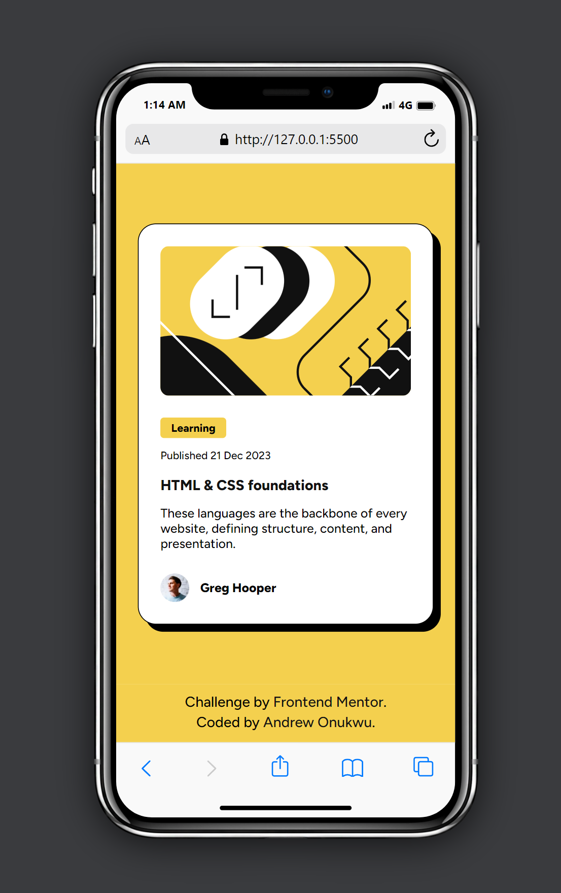
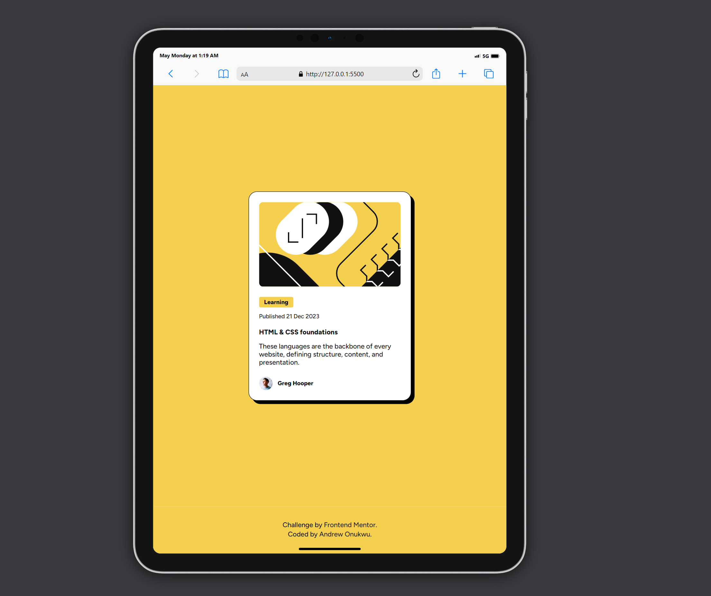

# Frontend Mentor - Blog preview card solution

This is a solution to the [Blog preview card challenge on Frontend Mentor](https://www.frontendmentor.io/challenges/blog-preview-card-ckPaj01IcS). Frontend Mentor challenges help you improve your coding skills by building realistic projects.

## Table of contents

- [The challenge](#the-challenge)
  - [Screenshot](#screenshot)
  - [Links](#links)
- [My process](#my-process)
  - [Built with](#built-with)
  - [What I learned](#what-i-learned)
  - [Continued development](#continued-development)
- [Author](#author)
- [Acknowledgments](#acknowledgments)

### The challenge

Users should be able to:

- See hover and focus states for all interactive elements on the page

### Screenshot

### Links

- Solution URL: [Link to the solution here](https://github.com/andychuks51/blog-preview-card-main)
- Live Site URL: [Link to the live site here](https://andychuks51.github.io/blog-preview-card-main/)

## My process

I first took my time to analyzed the layout this time, I had to get it right. After taking some time to see it then I began to design, created my HTML structure and then stylesheet.

### Built with

- Semantic HTML5 markup
- CSS custom properties
- Flexbox
- Mobile-first workflow

### What I learned

I learnt really in this section how to use figma design properly I'm still learning and I hope to solidify my knowledge in coming challenge.

### Continued development

I will continue to refine my understanding in creating more responsive design going forward and learn how to use media query better.

## Author

- Frontend Mentor - [@andy.chuks51@gmail.com](https://www.frontendmentor.io/profile/andychuks51)
- Twitter - [@drew_techie](https://x.com/drew_techie?t=OLuFzJqb8nFG57BscrejOA&s=09)

## Acknowledgments

I truly have God almighty to thank for giving me the opportunity complete this challenge and a big shout out to a member on FronterEnd Mentor that put me in the right direction... Thank you 😊🙏🙌
